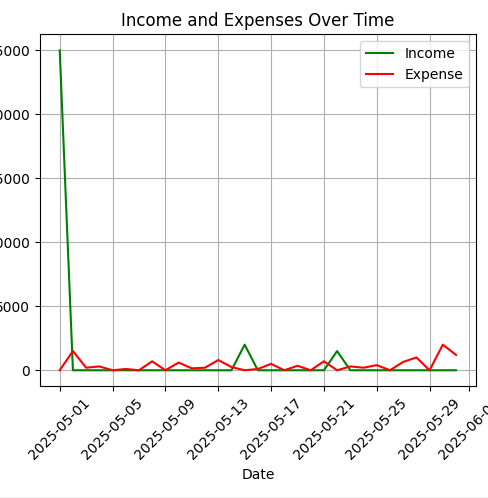

# 💸 Personal Finance Tracker 📊

A simple command-line application to track your income and expenses, view summaries, and visualize your financial data over time using Python and Pandas.

---

## ✨ Features

- ➕ **Add Transactions:** Record income or expenses with date, amount, category, and description.
- 📅 **View Transactions:** Filter and view transactions within a custom date range.
- 🧾 **Summary:** See total income, total expenses, and net savings for any period.
- 📈 **Plotting:** Visualize your income and expenses over time with a line plot.
- 💾 **Persistent Storage:** All data is saved in a CSV file (`financial_data.csv`).

---

## ⚙️ Requirements

- Python 3.x
- pandas
- matplotlib

Install dependencies with:
```sh
pip install pandas matplotlib
```

---

## 🚀 Usage

1. **Clone or download this repository.**
2. **Run the application:**
    ```sh
    python main.py
    ```
3. **Follow the on-screen menu:**
    - ➕ Add new transactions
    - 📅 View transactions and summary for a date range
    - 📈 Plot your income and expenses

---

## 🖼️ Example Plot

Below is a sample plot generated by the application:



---

## 📁 File Structure

```
.
├── main.py
├── data_entry.py
├── financial_data.csv
├── screenshot.png
└── README.md
```

---

## 📝 How It Works

- **Adding a Transaction:**  
  Enter the date, amount, category (Income/Expense), and a description. The entry is saved to `financial_data.csv`.

- **Viewing Transactions:**  
  Enter a start and end date to see all transactions in that range, along with a summary.

- **Plotting:**  
  After viewing transactions, you can choose to plot your income and expenses over time.

---

**Enjoy tracking your finances!** 🎉
